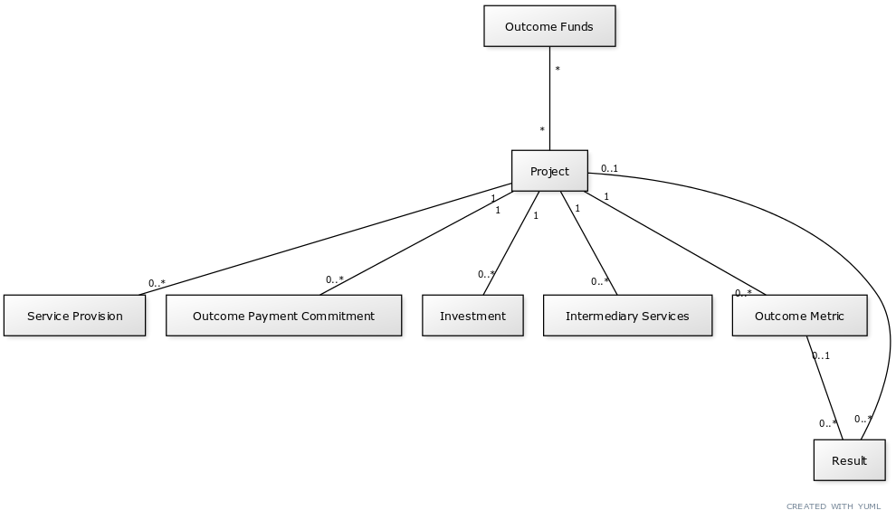
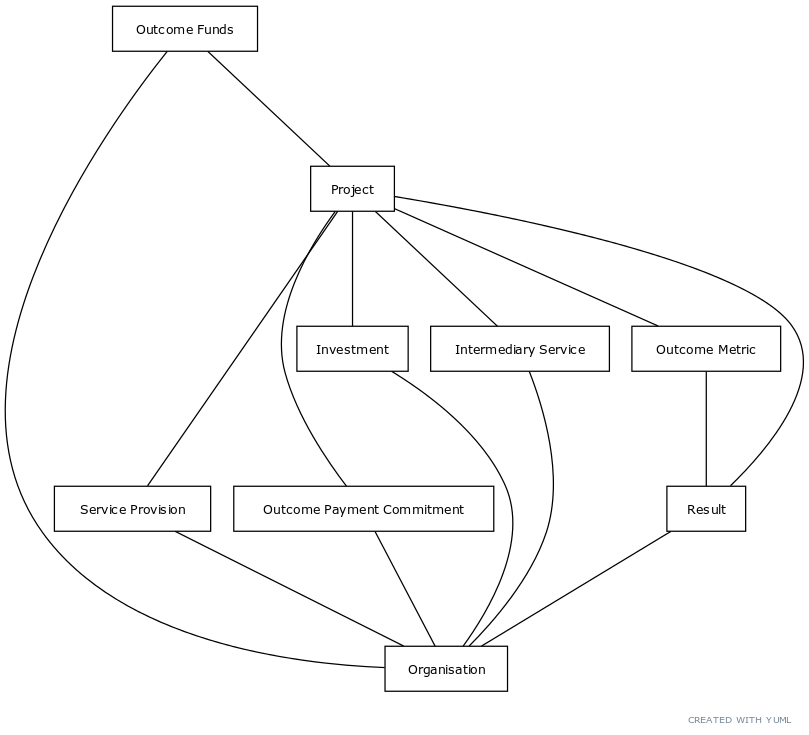
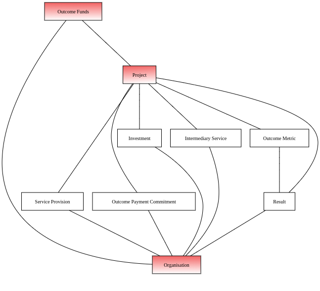

=====================================================================================================
INDIGO Data Specification | The International Network for Data on Impact and Government Outcomes
=====================================================================================================

.. contents:: Table of Contents

Background
==========

In early 2020, `Open Data Services Co-operative <https://opendataservices.coop/>`_. and the University of Oxford's `Government Outcomes Lab <https://golab.bsg.ox.ac.uk/>`_. collaborated on two initiatives: updating an Impact Bond Database and prototyping the collection of data on returns and non-financial technical assistance in the social investment sector.

These projects were built on the INDIGO Data Specification, an early attempt to standardise the data collected on social impact bonds. The impetus to standardise is familiar from other sectors: a desire to improve data quality, increase transparency and comparability and thereby provide levers for accountability that can improve outcomes and deliver better choices and value for money and in public service delivery.

Openness in the social impact bond sector is not yet the default and, to allay concerns over accuracy and confidentiality, the data model also emphasises traceability and attribution, and the ability to mark fields as disputed or not for public view after collection. Compatibility with these features is built into the accompanying `Government Outcomes Lab <https://golab.bsg.ox.ac.uk/>`_. application for creating, editing and managing INDIGO data.   

The data model
==============

The data model described here is intended as the first steps towards an open data standard. As more data is published using the model, we hope that the ideas here will provoke interest and criticism and be informed by wider conversations in the sector.

Overview of the data model
--------------------------

A high-level diagram representing the core data model is presented below.

A project is the building block of the INDIGO data specification, representing a single impact bond, social investment or other partnership.

A project can be further broken down into any number of components. These components may represent activities and agreements (like investments, delivery, technical assistance, outcome-based payment agreements and outcome metrics) or measurements of, or associated with, activities and their effect (like outcome metric results or financial performance).

Results and evaluations can be associated either with individual outcome metrics or the project as a whole.

Upstream sources of payment funding can be described by linking any number of outcome funds to a project.

Organisations and projects
--------------------------

In the high-level overview, a project is modelled as a composite of components. The structure of projects, and the broader sector, emerges by associating individual components of a project with one or more organisations.

An organisation may appear multiple times in a single project, in different roles, and also recur across projects. The organisation can be traced across projects using `INDIGO identifiers`_.

Some components also allow an organisation's role to be further broken down via a codelist.

.. admonition:: Example

   A diversified NGO makes an investment of USD250,000 in a project and is also involved in an aspect of service delivery. The same organisation would appear twice in the data that describes the project: first associated with an `Investment` and then associated with a `Service Provision`. Both of these would describe the organisation in the `Organisational Role Category` of "Nonprofit/NGO".

Project-level and disaggregated data
------------------------------------

A cross-sector collaboration is modelled in the INDIGO Data Specification as a project. A project can represent a social impact bond, outcomes based contract or similar partnership.

Project-level attributes provide an overview of a given project, and are designed to provide a useful and unambiguous overview and a backstop in the absence of more granular disclosures. 

A project can also be described in terms of its disaggregated components. These individual indicators provide more detail than is available at a project level and are a closer match for the composite nature of how social impact bonds are arranged, delivered and measured.

Project-level data should always be a complete and up-to-date representation of knowledge about a project. Data at a project-level may or may not include and account for the addition of and updates to disaggregated data. 

Disaggregated data should be a complete and up-to-date representation of the relevant individual component of a project. Where a corresponding project-level attribute exists, completeness of disaggregated disclosures should not be assumed.

.. admonition:: Example

   A social impact bond declares total investment committed of USD1,000,000 at the project level. Two disaggregated investment disclosures are available for the project, of USD250,000 and USD500,000. The sum of the disaggregated investments, USD750,000, does not match the total investment commitment for the overall project. There may be several reasons for this discrepancy, including confidentiality, and the project-level figure should be preferred.

Shared vs project-level data objects
------------------------------------

To reduce duplication and error and allow for easier analysis, the INDIGO data standard shares some data across all datasets. The shared objects are: projects, organisations, outcome funds and investment funds.

Shared objects are distinguished by identifiers with an 'INDIGO' prefix. See 

Each shared object should only be described once, and any new data or corrections added as updates rather than creating a new, duplicate object with a new INDIGO identifier.

Core and extended datasets
--------------------------

The data dictionary lists the datasets which fields are expected to appear in. The specification has no formal mechanism to  restrict the collection of data. But, in general, there is a 'core' set of data fields that all datasets are encouraged to collect; other datasets may collect extra fields for a specific purpose, either for learning purposes or as a result of a particular data-sharing agreement. The core data fields may expand over time, and become more formalised, as the specification matures. 

Working with and collecting data
================================

The data specification is described in detail in a data dictionary and in data entry spreadsheets. Three spreadsheet templates are provided, for projects, organisations and outcome funds.

Advanced users may wish to consult the JSON Schema used to transfer data from spreadsheets to the database application. 

.. warning::
   The JSON Schema describes the structure of the data model but not data types.

Identifiers
-----------

The INDIGO specification uses three kinds of identifier to link data internally and offers space to enhance the data with the identifiers of related disclosures.  

INDIGO identifiers
^^^^^^^^^^^^^^^^^^

INDIGO identifiers are assigned by the INDIGO project to projects, organisations and funds to ensure uniqueness for these important entities across all published datasets.

#### Real-world identifiers

#### Internal identifiers

#### Related disclosure identifiers

## Formatting data

### Dates

The specification allows for imprecise dates depending on how much information is known (e.g., 2020 or 2020-06). Dates must use the YYYY-MM-DD format.

### Currencies and currency conversion

A field describing a monetary value in the INDIGO specification will always have an accompanying currency field. Monetary values must be described as numbers only with no currency symbols, commas or textual descriptions of large numbers.

.. admonition:: Example

   A social impact bond 

### Sources

## About

This data model was produced by  `Open Data Services Co-operative <https://opendataservices.coop/>`_. as part of a project with the University of Oxford's `Government Outcomes Lab <https://golab.bsg.ox.ac.uk/>`_.